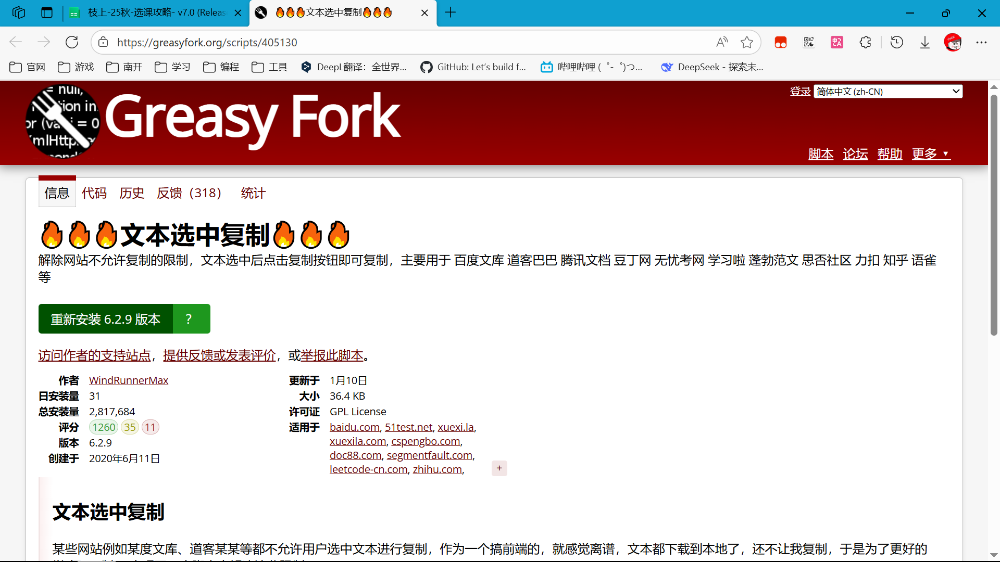
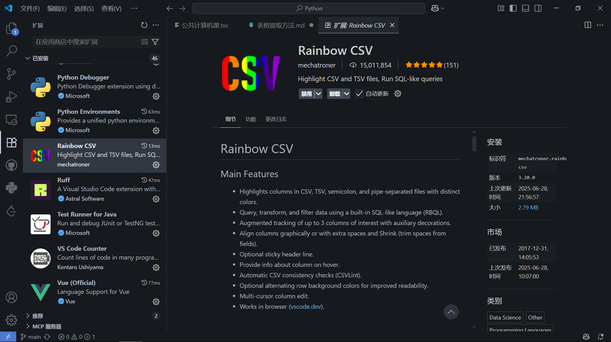
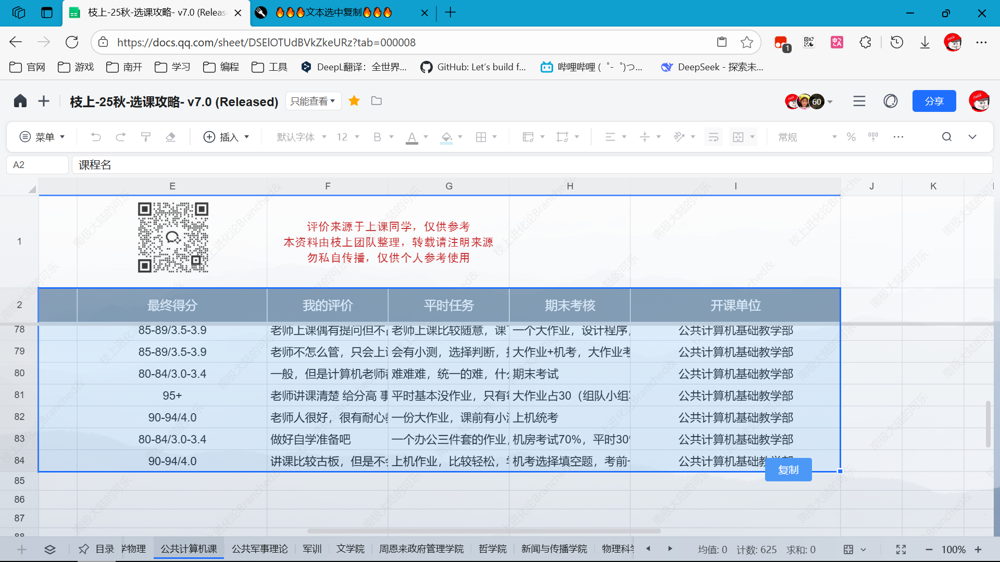
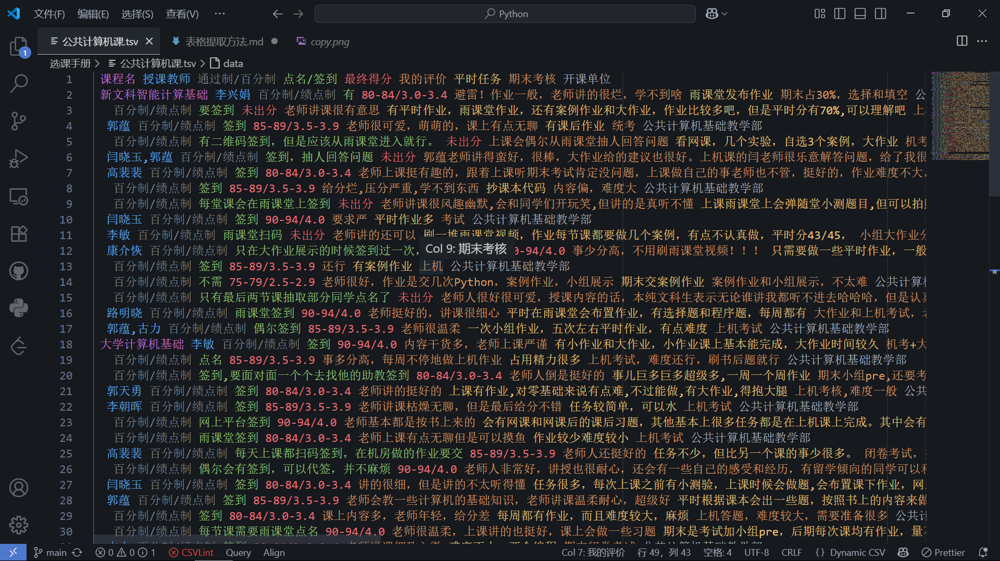
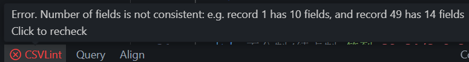
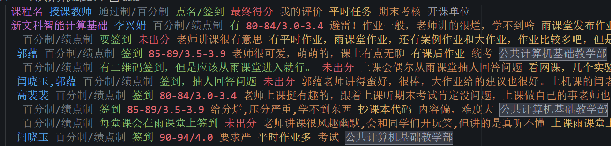

# 表格提取方法

## 准备

1. 浏览器安装油猴插件（Tampermonkey），下载[🔥🔥🔥 文本选中复制 🔥🔥🔥](https://greasyfork.org/scripts/405130)插件。
   
2. VSCode 安装 Rainbow CSV 插件。
   

## 步骤

1. 浏览器打开腾讯文档，选中需要复制的表格内容（选中左上角单元格，再按住 Shift 键选中右下角单元格，可以快速选中范围内所有单元格），此时会弹出“复制”按钮，点击复制。
   
2. 打开 VSCode，新建一个`.tsv`文件，粘贴。
   
3. 在文本编辑器区域，右键菜单--> Rainbow CSV -> Set rainbow separator，将分隔符设置为空格，并点击 Apply。
4. 回到 tsv 文件，发现表格已经变成彩色的了，说明分隔符设置成功。接下来，需要根据表格的实际情况，调整文本。根据 CSVLint 的提示，调整表格中的空格错误，这些错误主要来自单元格的文本中包含空格，建议的调整方法是将这些空格替换为某些特定字符，并在转为 xlsx 时再替换回来。
   
5. 调整完成后，CSVLint 变绿，说明表格格式正确，可以右键菜单--> Rainbow CSV -> Copy for Excel / Sheets export，然后在 xlsx 中粘贴即可。

## 注意事项

1. 如果单个单元格中包含换行符（表现为 tsv 中有多行），可以根据内容删除换行符，或者将换行符替换为某个特定字符。
2. 上述提到的特定字符，建议使用英文逗号`,`或下划线`_`，后期我在转为 xlsx 时会再替换回来。
3. 如果表格中有合并单元格，在 tsv 中会表现为某些单元格为空，只要显示的内容颜色标记是正确的，就说明没有问题。下图是一个合并单元格的例子。
   
